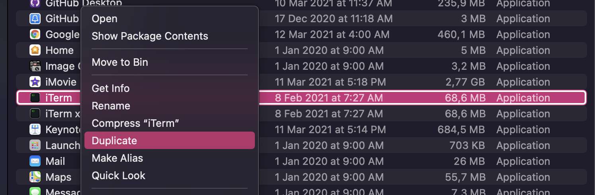
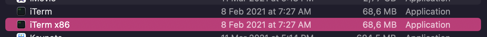

# Codeurs en Seine New Website
## 🚀 Quick start

1.  **Install dependencies**

    Navigate into your new site’s directory and start it up (require Node.js and yarn)

    ```shell
    yarn
    ```

1.  **Start developing.**

    ```shell
    yarn start
    ```

1.  **Open the source code and start editing!**

    Your site is now running at `http://localhost:8000`!

    _Note: You'll also see a second link: _`http://localhost:8000/___graphql`_. This is a tool you can use to experiment with querying your data. Learn more about using this tool in the [Gatsby tutorial](https://www.gatsbyjs.org/tutorial/part-five/#introducing-graphiql)._

    Open the `codeursenseine-new` directory in your code editor of choice and edit `src/pages/index.js`. Save your changes and the browser will update in real time!

## 👩‍💻👨‍💻 Create a new organiser

To quickly create a new organiser, you can run the following command:

```shell
yarn new:organiser
```

## Create a new year

### Archive past year

#### Redirection

Add year-1 redirection in `public-archive/netlify.toml`.

#### Build Archive

Update the `package.json` `archive:XXXX` where `XXXX` is the year, script with
the year to generate. Create the archive and serve it:

```shell
yarn archive:XXXX # generate a new archive
yarn archive:serve # serve the archive to check if everything is alright
```

#### Tag

Tag the latest commit.

`git tag -a archive-XXXX -m "Archive XXXX"`

### Initialize the new year website

#### Clean the content

Change the `currentYear` in `gatsby-config.js` and edit the content of the pages.

#### Create Netlify redirect

Create past year redirection in `netlify.toml`.

#### Add the past year in the Nav

Add the past year in the `src/components/Nav/NavPreviousYears.js` component.

## 🧐 What's inside?

A quick look at the top-level files and directories you'll see in a Gatsby project.

    .
    ├── node_modules
    ├── src
    ├── .gitignore
    ├── .prettierrc
    ├── gatsby-browser.js
    ├── gatsby-config.js
    ├── gatsby-node.js
    ├── gatsby-ssr.js
    ├── LICENSE
    ├── package-lock.json
    ├── package.json
    └── README.md

1.  **`/node_modules`**: This directory contains all of the modules of code that your project depends on (npm packages) are automatically installed.

2.  **`/src`**: This directory will contain all of the code related to what you will see on the front-end of your site (what you see in the browser) such as your site header or a page template. `src` is a convention for “source code”.

3.  **`.gitignore`**: This file tells git which files it should not track / not maintain a version history for.

4.  **`.prettierrc`**: This is a configuration file for [Prettier](https://prettier.io/). Prettier is a tool to help keep the formatting of your code consistent.

5.  **`gatsby-browser.js`**: This file is where Gatsby expects to find any usage of the [Gatsby browser APIs](https://www.gatsbyjs.org/docs/browser-apis/) (if any). These allow customization/extension of default Gatsby settings affecting the browser.

6.  **`gatsby-config.js`**: This is the main configuration file for a Gatsby site. This is where you can specify information about your site (metadata) like the site title and description, which Gatsby plugins you’d like to include, etc. (Check out the [config docs](https://www.gatsbyjs.org/docs/gatsby-config/) for more detail).

7.  **`gatsby-node.js`**: This file is where Gatsby expects to find any usage of the [Gatsby Node APIs](https://www.gatsbyjs.org/docs/node-apis/) (if any). These allow customization/extension of default Gatsby settings affecting pieces of the site build process.

8.  **`gatsby-ssr.js`**: This file is where Gatsby expects to find any usage of the [Gatsby server-side rendering APIs](https://www.gatsbyjs.org/docs/ssr-apis/) (if any). These allow customization of default Gatsby settings affecting server-side rendering.

9.  **`LICENSE`**: Gatsby is licensed under the MIT license.

10. **`package-lock.json`** (See `package.json` below, first). This is an automatically generated file based on the exact versions of your npm dependencies that were installed for your project. **(You won’t change this file directly).**

11. **`package.json`**: A manifest file for Node.js projects, which includes things like metadata (the project’s name, author, etc). This manifest is how npm knows which packages to install for your project.

12. **`README.md`**: A text file containing useful reference information about your project.

## 🐛 Troubleshooting

### 🍎 arm64 Apple Hardware Architecture

Some dependencies are not yet available to compile on M1 Apple hardware, so the
best way to contribute on this project is to run Node.js in Rosetta mode (i386).

#### Duplicate your terminal application

In `Finder > Applications`, right click on your favorite terminal application
and duplicate it.



Rename the copy to something understandable (in my case **iterm x86**)



#### Enable Rosetta mode on the copy

Right click on the copy and check `Open using Rosetta`. Then, open this terminal
and check the architecture is `i386` by entering `arch` in the terminal.

Install Node.js (14 is the LTS at the moment of writing these lines).
You can then install `yarn` using `npm install -g yarn` and then start to work.
